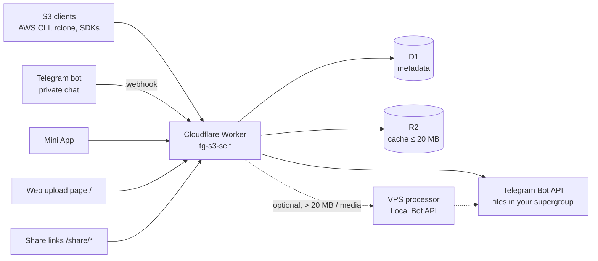

# TG-S3 (self-hosted template)

**English** | [Tiếng Việt](README.vi.md)

**Telegram-backed S3-compatible storage on Cloudflare Workers**

---

TG-S3 turns Telegram into an S3-compatible object storage backend. Files are stored as messages in a Telegram supergroup, metadata lives in Cloudflare D1, small files are cached in Cloudflare R2, and everything runs on a single Cloudflare Worker with zero runtime dependencies.

This repository is a **fork-ready template**: fork it, add a few GitHub Secrets, and GitHub Actions creates the Cloudflare resources, deploys the Worker, and registers the Telegram webhook for you.

## Features

- **S3-compatible API**: 27 operations including multipart upload, presigned URLs and conditional requests (AWS SigV4)
- **Telegram as storage**: files are kept in your own Telegram supergroup
- **Three-tier caching**: Cloudflare CDN (L1) → R2 (L2) → Telegram (L3)
- **Telegram bot**: manage buckets, files and share links from a private chat with the bot
- **Mini App**: web UI inside Telegram (file browser, uploads, shares, S3 credentials)
- **File sharing**: share links with optional password, expiry and download limits
- **Server-side encryption**: SSE-C (customer keys) and SSE-S3 (server-managed key) with AES-256-GCM
- **Public web upload page**: drag-and-drop page at `/` for files up to 20 MB, returns a public link. **Enabled by default**, read the [security warning](#security-warning) below
- **Large files (optional)**: up to 2 GB through a VPS processor with the Telegram Local Bot API
- **Media processing (optional, VPS)**: image conversion (HEIC/WebP), video transcoding, Live Photo handling
- **Multi-credential auth**: S3 credentials stored in D1 with per-bucket and read-only/read-write permissions
- **Low cost**: the core runs on the Cloudflare free tier

## Quick start: Fork + GitHub Actions

You need: a GitHub account, a [Cloudflare account](https://dash.cloudflare.com), and Telegram.

### 1. Prepare Telegram

1. Create a bot with [@BotFather](https://t.me/BotFather) (`/newbot`) and copy the **bot token**.
2. Create a Telegram **supergroup** (private is fine), add the bot and make it an **administrator**. This group is where files are stored.
3. Get the group's **chat ID** (it looks like `-1001234567890`), for example by forwarding a message from the group to [@userinfobot](https://t.me/userinfobot) or a similar bot.
4. Get **your own Telegram user ID** (send any message to [@userinfobot](https://t.me/userinfobot)). Only the user IDs you list can use the bot.

### 2. Prepare Cloudflare

1. **One-time: register a `workers.dev` subdomain.** In the Cloudflare dashboard open **Workers & Pages** and pick a subdomain when asked (or under the account's Workers subdomain setting). Without it the first deploy fails with `You need to register a workers.dev subdomain before publishing to workers.dev`. Only needed when you do not use `CUSTOM_DOMAIN`.
2. Copy your **Account ID** (shown in the dashboard, e.g. on the Workers & Pages overview, and in the URL `dash.cloudflare.com/<account-id>`).
3. Create an **API token** at [dash.cloudflare.com/profile/api-tokens](https://dash.cloudflare.com/profile/api-tokens) → *Create Custom Token* with these permissions:
   - Account → **Workers Scripts: Edit**
   - Account → **D1: Edit**
   - Account → **Workers R2 Storage: Edit**
   - Account → **Account Settings: Read**
   - Only if you use a custom domain: Zone → **Workers Routes: Edit** and **DNS: Edit** for that zone

### 3. Fork and configure the repository

1. Fork this repository on GitHub.
2. In your fork open **Settings → Secrets and variables → Actions**.
3. On the **Secrets** tab add:

| Secret | Required | Value |
|---|---|---|
| `CLOUDFLARE_API_TOKEN` | yes | API token from step 2 |
| `CLOUDFLARE_ACCOUNT_ID` | yes | Cloudflare Account ID |
| `TG_BOT_TOKEN` | yes | Bot token from @BotFather |
| `DEFAULT_CHAT_ID` | yes | Supergroup chat ID, e.g. `-1001234567890` (bot must be admin) |
| `TG_ADMIN_IDS` | yes | Comma-separated Telegram user IDs allowed to use the bot and the Mini App, e.g. `123456789,987654321` |
| `SSE_MASTER_KEY` | no | Key for SSE-S3 encryption, e.g. output of `openssl rand -base64 32`. Do not change it once objects are encrypted with it |
| `VPS_URL` | no | URL of your VPS processor (large files / media), see [deployment guide](docs/deployment.md) |
| `VPS_SECRET` | no | Shared secret between Worker and VPS processor |

4. On the **Variables** tab add:

| Variable | Required | Value |
|---|---|---|
| `DEPLOY_ENABLED` | yes | `true`. Without it the deploy job is **skipped** |
| `CUSTOM_DOMAIN` | no | e.g. `files.example.com`, a hostname on a zone in the **same** Cloudflare account. CI then attaches it to the Worker and sets `workers_dev = false`. Use a dedicated, unused hostname: CI re-points an existing DNS record or Custom Domain on it to this Worker without asking |
| `WEB_UPLOAD_BUCKET` | no | Bucket for the public web upload page. Unset = `files` (ON). `off` = disabled |

### 4. Enable Actions and deploy

1. Open the **Actions** tab of your fork. GitHub disables workflows in forks by default: click **I understand my workflows, go ahead and enable them**.
2. Select **Deploy to Cloudflare Workers** → **Run workflow** (branch `main`). Every later push to `main` also redeploys.
3. The workflow creates the D1 database `tg-s3-self-db` and the R2 bucket `tg-s3-self-cache` if missing, applies migrations, deploys the Worker `tg-s3-self` with your secrets, and registers the Telegram webhook. The job log prints the **Worker URL** (`https://tg-s3-self.<your-subdomain>.workers.dev` or `https://<CUSTOM_DOMAIN>`) and whether web upload is ON.
4. In a **private chat** with your bot send `/start`, then `/miniapp` to open the Mini App. The bot ignores messages in groups.
5. Optional: to get the `/` command menu in Telegram, set it yourself with @BotFather `/setcommands` (neither CI nor `deploy.sh` registers it).

If something fails, see the troubleshooting section of the [deployment guide](docs/deployment.md).

## Security warning

> [!WARNING]
> 1. **Web upload is enabled by default.** Anyone who knows your Worker URL can upload files (up to 20 MB each) through the page at `/` and get public links, without logging in. The Worker has **no built-in rate limit** for this. It can be abused (spam, illegal content) and may get your Telegram bot or group banned.
> 2. **Protect it with Cloudflare**, using a **custom domain** on a Cloudflare zone (WAF rules and Access do not apply to `*.workers.dev`):
>    - a **WAF rate limiting rule** on path `/api/web-upload` (e.g. more than 5 requests per 10 seconds per IP → Block; available on the Free plan, see [Cloudflare docs](https://developers.cloudflare.com/waf/rate-limiting-rules/)), and/or
>    - **Cloudflare Access** (Zero Trust) on `/api/web-upload` only, so only allowed emails can upload. Never put Access in front of `/bot/webhook`, S3 paths or `/share/*`.
>    - With GitHub Actions, setting the `CUSTOM_DOMAIN` variable also turns off the unprotected `*.workers.dev` URL (`workers_dev = false`).
>
>    Step-by-step dashboard instructions: [docs/web-upload.md](docs/web-upload.md).
> 3. **Or disable it:** set the GitHub Variable `WEB_UPLOAD_BUCKET` to `off` and re-run the workflow.

## Architecture



| Component | Role | Cost |
|---|---|---|
| Cloudflare Worker | S3 API, bot webhook, Mini App, web upload, share links | Free tier |
| Cloudflare D1 | Metadata (objects, buckets, shares, credentials) | Free tier |
| Cloudflare R2 | Cache for files ≤ 20 MB | Free tier (10 GB) |
| Telegram | File storage | Free |
| VPS + processor | Files > 20 MB, media processing | Optional, your VPS |

## Alternative: local deploy with deploy.sh

Use this path to deploy from your own machine, or to run the optional VPS processor (Docker) for files larger than 20 MB via the Telegram Local Bot API. Requirements: Node.js 22+, and Docker for the VPS stack.

```bash
# in your fork's clone
cp .env.example .env
# edit .env: TG_BOT_TOKEN, DEFAULT_CHAT_ID, TG_ADMIN_IDS, CLOUDFLARE_API_TOKEN
# optional: CLOUDFLARE_ACCOUNT_ID, CF_CUSTOM_DOMAIN, TELEGRAM_API_ID / TELEGRAM_API_HASH (Local Bot API, 2 GB files)
./deploy.sh
```

`deploy.sh` detects the environment: with Docker it builds the images, deploys the Worker, configures a Cloudflare Tunnel `tg-s3-self` (needs `CF_CUSTOM_DOMAIN`; the processor is exposed at `vps.<CF_CUSTOM_DOMAIN>`) and starts the services; without Docker it deploys the Worker with local wrangler. It generates `VPS_SECRET` and `SSE_MASTER_KEY` automatically.

Notes for this path:

- `deploy.sh` does **not** read `WEB_UPLOAD_BUCKET` from `.env`. To change or disable web upload, edit `WEB_UPLOAD_BUCKET` in `wrangler.toml` `[vars]` (e.g. `"off"`).
- `deploy.sh` does not attach a custom domain to the Worker. To serve the Worker on your domain, add a `[[routes]]` entry with `custom_domain = true` to `wrangler.toml` and set `workers_dev = false`.

Full details: [deployment guide](docs/deployment.md) and [configuration reference](docs/configuration.md).

## Verify with AWS CLI or rclone

S3 credentials are created in the Mini App: send `/miniapp` to the bot, open the **Keys** tab and create a credential (access key ID + secret). Then point any S3 client at your Worker URL using **path-style** addressing and region `us-east-1`.

```bash
# AWS CLI
aws configure set aws_access_key_id YOUR_ACCESS_KEY_ID
aws configure set aws_secret_access_key YOUR_SECRET_ACCESS_KEY
aws configure set region us-east-1
aws configure set default.s3.addressing_style path
aws --endpoint-url https://tg-s3-self.<your-subdomain>.workers.dev s3 mb s3://test
echo hello > hello.txt
aws --endpoint-url https://tg-s3-self.<your-subdomain>.workers.dev s3 cp hello.txt s3://test/
aws --endpoint-url https://tg-s3-self.<your-subdomain>.workers.dev s3 ls s3://test/

# rclone
rclone config create tgs3 s3 \
  provider=Other \
  access_key_id=YOUR_ACCESS_KEY_ID \
  secret_access_key=YOUR_SECRET_ACCESS_KEY \
  endpoint=https://tg-s3-self.<your-subdomain>.workers.dev \
  region=us-east-1 \
  force_path_style=true \
  acl=private
rclone ls tgs3:test
```

Replace the endpoint with `https://files.example.com` if you use a custom domain.

## S3 compatibility

| Category | Operations |
|---|---|
| Objects | GetObject, PutObject, HeadObject, DeleteObject, DeleteObjects, CopyObject |
| Tagging | GetObjectTagging, PutObjectTagging, DeleteObjectTagging |
| Listing | ListObjectsV2, ListObjects (v1) |
| Multipart | CreateMultipartUpload, UploadPart, UploadPartCopy, CompleteMultipartUpload, AbortMultipartUpload, ListParts, ListMultipartUploads |
| Buckets | ListBuckets, CreateBucket, DeleteBucket, HeadBucket, GetBucketLocation, GetBucketVersioning |
| Lifecycle | GetBucketLifecycleConfiguration, PutBucketLifecycleConfiguration, DeleteBucketLifecycleConfiguration |
| Auth | AWS SigV4 (multi-credential), presigned URLs, Bearer token, Telegram initData |

Not supported by design: versioning, ACLs, cross-region replication. Details: [docs/S3-COMPAT.md](docs/S3-COMPAT.md).

## Telegram bot commands

The bot only answers in a **private chat** and only to users listed in `TG_ADMIN_IDS`.

| Command | Description |
|---|---|
| `/start` | Welcome message |
| `/help` | Command reference |
| `/buckets` | List buckets |
| `/ls <bucket> [prefix]` | List objects |
| `/info <bucket> <key>` | Object details |
| `/search <bucket> <query>` | Search objects |
| `/share <bucket> <key>` | Create a share link |
| `/shares` | List active shares |
| `/revoke <token>` | Revoke a share |
| `/delete <bucket> <key>` | Delete an object (with confirmation) |
| `/stats` | Storage statistics |
| `/setbucket <name>` | Set your default bucket |
| `/miniapp` | Open the Mini App |

Send a file to the bot to upload it to your default bucket (set with `/setbucket`; otherwise the first **private** bucket — public buckets such as the web upload bucket `files` are never picked implicitly). The command menu is not registered automatically; set it with @BotFather `/setcommands`. Full reference: [docs/bot-commands.md](docs/bot-commands.md).

## Security notes

- **Web upload** is public and ON by default. Protect or disable it as described in the [security warning](#security-warning) and [docs/web-upload.md](docs/web-upload.md). Its target bucket is created as **public** on first upload; an existing private bucket with the same name is never made public (uploads then fail with 403). Only images, video, audio, PDF and plain text keep their content type; anything else (HTML, SVG, scripts, …) is stored as `application/octet-stream` so it is downloaded, not rendered on your domain.
- **`TG_ADMIN_IDS` is required** and limits who can use the bot **and** the Mini App API: only the listed Telegram user IDs are accepted. If it is empty, any Telegram user who opens the Mini App gets in, which is why CI and `deploy.sh` refuse to deploy without it.
- **Keep secrets secret**: `TG_BOT_TOKEN` controls your bot and also derives the webhook secret; `CLOUDFLARE_API_TOKEN` can modify your Cloudflare account. Rotate them if leaked and re-run the workflow.
- **`SSE_MASTER_KEY`**: objects encrypted with SSE-S3 cannot be read without the same key. Back it up and do not change it.
- **Telegram is the storage layer**: anyone who is a member of the storage supergroup can see the files. Keep the group private.
- **Least-privilege API token**: grant only the permissions listed in the Quick start.

## Documentation

- [Deployment guide](docs/deployment.md): GitHub Actions, `deploy.sh`, custom domain, troubleshooting
- [Configuration reference](docs/configuration.md): every variable and where to set it
- [Web upload](docs/web-upload.md): behavior, disabling, Cloudflare WAF / Access protection
- [Bot commands](docs/bot-commands.md)
- [S3 compatibility](docs/S3-COMPAT.md) (English only)

## Local development

```bash
npm install
npx wrangler d1 migrations apply tg-s3-self-db --local
printf 'TG_BOT_TOKEN=123456:ABC...\nDEFAULT_CHAT_ID=-1001234567890\n' > .dev.vars
X_LOCAL_EXPLORER=false npx wrangler dev
npm run typecheck
```

`X_LOCAL_EXPLORER=false` is needed with wrangler 4.90: because `database_id` is empty in `wrangler.toml`, plain `wrangler dev` stops with `The expression evaluated to a falsy value: (databaseId)`.

## Tech stack

- **Runtime:** Cloudflare Workers (zero runtime dependencies)
- **Database:** Cloudflare D1 (SQLite)
- **Cache:** Cloudflare R2 + Cache API
- **Auth:** AWS SigV4, presigned URLs, Bearer tokens
- **Language:** TypeScript (strict mode)
- **Media processing:** Sharp + FFmpeg (VPS only)
- **Tooling:** wrangler v4, Node.js 22+ (CI uses Node.js 24)
