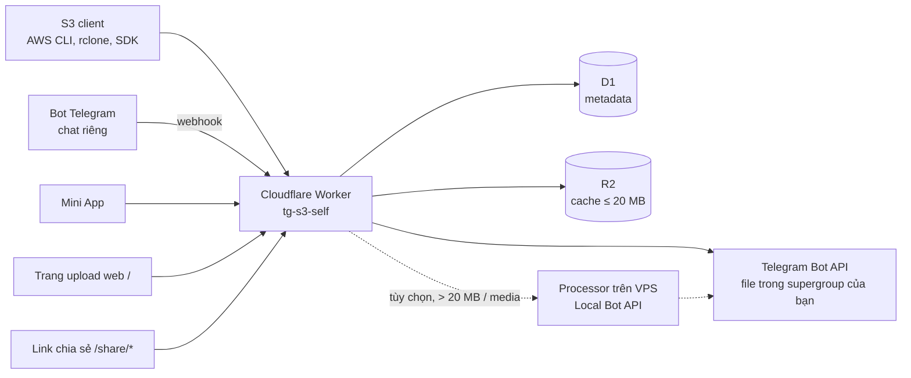

# TG-S3 (mẫu tự triển khai)

[English](README.md) | **Tiếng Việt**

**Kho lưu trữ tương thích S3 dùng Telegram làm nơi chứa file, chạy trên Cloudflare Workers**

---

TG-S3 biến Telegram thành một backend lưu trữ đối tượng tương thích S3. File được lưu dưới dạng tin nhắn trong một supergroup Telegram, metadata nằm ở Cloudflare D1, file nhỏ được cache trong Cloudflare R2, và toàn bộ chạy trên một Cloudflare Worker duy nhất, không có phụ thuộc runtime nào.

Repo này là một **mẫu sẵn sàng để fork**: bạn fork về, thêm vài GitHub Secret, rồi GitHub Actions sẽ tự tạo tài nguyên Cloudflare, deploy Worker và đăng ký webhook Telegram cho bạn.

## Tính năng

- **API tương thích S3**: 27 thao tác, gồm multipart upload, presigned URL và request có điều kiện (AWS SigV4)
- **Telegram làm nơi lưu trữ**: file nằm trong supergroup Telegram của chính bạn
- **Cache ba tầng**: Cloudflare CDN (L1) → R2 (L2) → Telegram (L3)
- **Bot Telegram**: quản lý bucket, file và link chia sẻ ngay trong chat riêng với bot
- **Mini App**: giao diện web trong Telegram (duyệt file, upload, chia sẻ, tạo S3 credential)
- **Chia sẻ file**: link chia sẻ có thể đặt mật khẩu, thời hạn và giới hạn lượt tải
- **Mã hóa phía server**: SSE-C (khóa do client cung cấp) và SSE-S3 (khóa do server quản lý) với AES-256-GCM
- **Trang upload web công khai**: trang kéo-thả tại `/` cho file tối đa 20 MB, trả về link công khai. **Bật sẵn mặc định**, hãy đọc [cảnh báo bảo mật](#cảnh-báo-bảo-mật) bên dưới
- **File lớn (tùy chọn)**: tới 2 GB qua processor trên VPS dùng Telegram Local Bot API
- **Xử lý media (tùy chọn, VPS)**: chuyển đổi ảnh (HEIC/WebP), chuyển mã video, xử lý Live Photo
- **Nhiều credential**: S3 credential lưu trong D1, phân quyền theo bucket và chỉ-đọc/đọc-ghi
- **Chi phí thấp**: phần lõi chạy trong gói miễn phí của Cloudflare

## Bắt đầu nhanh: Fork + GitHub Actions

Bạn cần: tài khoản GitHub, [tài khoản Cloudflare](https://dash.cloudflare.com) và Telegram.

### 1. Chuẩn bị Telegram

1. Tạo bot bằng [@BotFather](https://t.me/BotFather) (`/newbot`) và sao chép **bot token**.
2. Tạo một **supergroup** Telegram (để riêng tư cũng được), thêm bot vào và đặt bot làm **quản trị viên**. Đây là nơi chứa file.
3. Lấy **chat ID** của group (dạng `-1001234567890`), ví dụ bằng cách chuyển tiếp một tin nhắn trong group tới [@userinfobot](https://t.me/userinfobot) hoặc bot tương tự.
4. Lấy **user ID Telegram của bạn** (nhắn bất kỳ tin nào cho [@userinfobot](https://t.me/userinfobot)). Chỉ những user ID bạn liệt kê mới dùng được bot.

### 2. Chuẩn bị Cloudflare

1. **Làm một lần: đăng ký subdomain `workers.dev`.** Trong dashboard Cloudflare, mở **Workers & Pages** và chọn subdomain khi được hỏi (hoặc trong phần cài đặt Workers subdomain của tài khoản). Nếu chưa đăng ký, lần deploy đầu sẽ lỗi `You need to register a workers.dev subdomain before publishing to workers.dev`. Chỉ cần khi bạn không dùng `CUSTOM_DOMAIN`.
2. Sao chép **Account ID** (hiển thị trong dashboard, ví dụ ở trang tổng quan Workers & Pages, và trong URL `dash.cloudflare.com/<account-id>`).
3. Tạo **API token** tại [dash.cloudflare.com/profile/api-tokens](https://dash.cloudflare.com/profile/api-tokens) → *Create Custom Token* với các quyền:
   - Account → **Workers Scripts: Edit**
   - Account → **D1: Edit**
   - Account → **Workers R2 Storage: Edit**
   - Account → **Account Settings: Read**
   - Chỉ khi dùng tên miền riêng: Zone → **Workers Routes: Edit** và **DNS: Edit** cho zone đó

### 3. Fork và cấu hình repo

1. Fork repo này trên GitHub.
2. Trong bản fork, mở **Settings → Secrets and variables → Actions**.
3. Ở tab **Secrets**, thêm:

| Secret | Bắt buộc | Giá trị |
|---|---|---|
| `CLOUDFLARE_API_TOKEN` | có | API token ở bước 2 |
| `CLOUDFLARE_ACCOUNT_ID` | có | Account ID Cloudflare |
| `TG_BOT_TOKEN` | có | Bot token từ @BotFather |
| `DEFAULT_CHAT_ID` | có | Chat ID của supergroup, ví dụ `-1001234567890` (bot phải là quản trị viên) |
| `TG_ADMIN_IDS` | có | Các user ID Telegram được phép dùng bot và Mini App, cách nhau bằng dấu phẩy, ví dụ `123456789,987654321` |
| `SSE_MASTER_KEY` | không | Khóa cho mã hóa SSE-S3, ví dụ kết quả của `openssl rand -base64 32`. Đừng đổi khóa sau khi đã có object được mã hóa bằng nó |
| `VPS_URL` | không | URL của processor trên VPS (file lớn / media), xem [hướng dẫn triển khai](docs/deployment.vi.md) |
| `VPS_SECRET` | không | Khóa bí mật dùng chung giữa Worker và processor trên VPS |

4. Ở tab **Variables**, thêm:

| Variable | Bắt buộc | Giá trị |
|---|---|---|
| `DEPLOY_ENABLED` | có | `true`. Thiếu biến này thì job deploy sẽ bị **bỏ qua (skipped)** |
| `CUSTOM_DOMAIN` | không | Ví dụ `files.example.com`, một hostname thuộc zone nằm **cùng** tài khoản Cloudflare. Khi đó CI gắn tên miền vào Worker và đặt `workers_dev = false`. Hãy dùng một hostname riêng, chưa dùng cho việc gì: CI sẽ trỏ bản ghi DNS hoặc Custom Domain đang có trên hostname đó sang Worker này mà không hỏi |
| `WEB_UPLOAD_BUCKET` | không | Bucket cho trang upload web công khai. Không đặt = `files` (BẬT). `off` = tắt |

### 4. Bật Actions và deploy

1. Mở tab **Actions** của bản fork. GitHub mặc định tắt workflow ở repo fork: bấm **I understand my workflows, go ahead and enable them**.
2. Chọn **Deploy to Cloudflare Workers** → **Run workflow** (nhánh `main`). Mỗi lần push lên `main` sau đó cũng sẽ deploy lại.
3. Workflow tạo D1 database `tg-s3-self-db` và R2 bucket `tg-s3-self-cache` nếu chưa có, chạy migration, deploy Worker `tg-s3-self` kèm secret của bạn và đăng ký webhook Telegram. Log của job in ra **Worker URL** (`https://tg-s3-self.<your-subdomain>.workers.dev` hoặc `https://<CUSTOM_DOMAIN>`) và cho biết upload web đang BẬT hay TẮT.
4. Trong **chat riêng** với bot, gửi `/start`, rồi `/miniapp` để mở Mini App. Bot bỏ qua tin nhắn trong group.
5. Tùy chọn: để có menu lệnh `/` trong Telegram, tự đặt bằng @BotFather `/setcommands` (cả CI lẫn `deploy.sh` đều không đăng ký menu này).

Nếu có lỗi, xem phần xử lý sự cố trong [hướng dẫn triển khai](docs/deployment.vi.md).

## Cảnh báo bảo mật

> [!WARNING]
> 1. **Upload web được bật sẵn mặc định.** Bất kỳ ai biết URL Worker của bạn đều có thể upload file (tối đa 20 MB mỗi file) qua trang `/` và nhận link công khai, không cần đăng nhập. Worker **không có giới hạn tốc độ (rate limit) tích hợp** cho chức năng này. Nó có thể bị lạm dụng (spam, nội dung phạm pháp) và khiến bot hoặc group Telegram của bạn bị khóa.
> 2. **Bảo vệ bằng Cloudflare**, với điều kiện dùng **tên miền riêng** trên một zone Cloudflare (quy tắc WAF và Access không áp dụng cho `*.workers.dev`):
>    - một **quy tắc WAF rate limiting** cho đường dẫn `/api/web-upload` (ví dụ quá 5 request trong 10 giây mỗi IP → Block; có trong gói Free, xem [tài liệu Cloudflare](https://developers.cloudflare.com/waf/rate-limiting-rules/)), và/hoặc
>    - **Cloudflare Access** (Zero Trust) chỉ cho `/api/web-upload` để chỉ những email được cho phép mới upload được. Tuyệt đối không đặt Access trước `/bot/webhook`, các đường dẫn S3 hay `/share/*`.
>    - Với GitHub Actions, đặt biến `CUSTOM_DOMAIN` cũng sẽ tắt luôn URL `*.workers.dev` không được bảo vệ (`workers_dev = false`).
>
>    Hướng dẫn từng bước trên dashboard: [docs/web-upload.vi.md](docs/web-upload.vi.md).
> 3. **Hoặc tắt hẳn:** đặt GitHub Variable `WEB_UPLOAD_BUCKET` thành `off` rồi chạy lại workflow.

## Kiến trúc



| Thành phần | Vai trò | Chi phí |
|---|---|---|
| Cloudflare Worker | S3 API, webhook bot, Mini App, upload web, link chia sẻ | Gói miễn phí |
| Cloudflare D1 | Metadata (object, bucket, chia sẻ, credential) | Gói miễn phí |
| Cloudflare R2 | Cache cho file ≤ 20 MB | Gói miễn phí (10 GB) |
| Telegram | Lưu trữ file | Miễn phí |
| VPS + processor | File > 20 MB, xử lý media | Tùy chọn, VPS của bạn |

## Cách khác: deploy cục bộ bằng deploy.sh

Dùng cách này khi muốn deploy từ máy của bạn, hoặc để chạy processor trên VPS (Docker) cho file lớn hơn 20 MB qua Telegram Local Bot API. Yêu cầu: Node.js 22+, và Docker nếu chạy bộ dịch vụ VPS.

```bash
# trong bản clone từ repo fork của bạn
cp .env.example .env
# sửa .env: TG_BOT_TOKEN, DEFAULT_CHAT_ID, TG_ADMIN_IDS, CLOUDFLARE_API_TOKEN
# tùy chọn: CLOUDFLARE_ACCOUNT_ID, CF_CUSTOM_DOMAIN, TELEGRAM_API_ID / TELEGRAM_API_HASH (Local Bot API, file 2 GB)
./deploy.sh
```

`deploy.sh` tự nhận diện môi trường: có Docker thì build image, deploy Worker, cấu hình Cloudflare Tunnel `tg-s3-self` (cần `CF_CUSTOM_DOMAIN`; processor được mở ra tại `vps.<CF_CUSTOM_DOMAIN>`) và khởi động các dịch vụ; không có Docker thì deploy Worker bằng wrangler cục bộ. Script tự sinh `VPS_SECRET` và `SSE_MASTER_KEY`.

Lưu ý cho cách này:

- `deploy.sh` **không** đọc `WEB_UPLOAD_BUCKET` từ `.env`. Muốn đổi hoặc tắt upload web, sửa `WEB_UPLOAD_BUCKET` trong `[vars]` của `wrangler.toml` (ví dụ `"off"`).
- `deploy.sh` không gắn tên miền riêng vào Worker. Muốn Worker chạy trên tên miền của bạn, thêm mục `[[routes]]` với `custom_domain = true` vào `wrangler.toml` và đặt `workers_dev = false`.

Chi tiết: [hướng dẫn triển khai](docs/deployment.vi.md) và [tham chiếu cấu hình](docs/configuration.vi.md).

## Kiểm tra bằng AWS CLI hoặc rclone

S3 credential được tạo trong Mini App: gửi `/miniapp` cho bot, mở tab **Keys** và tạo một credential (access key ID + secret). Sau đó trỏ bất kỳ S3 client nào tới URL Worker, dùng kiểu địa chỉ **path-style** và region `us-east-1`.

```bash
# AWS CLI
aws configure set aws_access_key_id YOUR_ACCESS_KEY_ID
aws configure set aws_secret_access_key YOUR_SECRET_ACCESS_KEY
aws configure set region us-east-1
aws configure set default.s3.addressing_style path
aws --endpoint-url https://tg-s3-self.<your-subdomain>.workers.dev s3 mb s3://test
echo hello > hello.txt
aws --endpoint-url https://tg-s3-self.<your-subdomain>.workers.dev s3 cp hello.txt s3://test/
aws --endpoint-url https://tg-s3-self.<your-subdomain>.workers.dev s3 ls s3://test/

# rclone
rclone config create tgs3 s3 \
  provider=Other \
  access_key_id=YOUR_ACCESS_KEY_ID \
  secret_access_key=YOUR_SECRET_ACCESS_KEY \
  endpoint=https://tg-s3-self.<your-subdomain>.workers.dev \
  region=us-east-1 \
  force_path_style=true \
  acl=private
rclone ls tgs3:test
```

Nếu dùng tên miền riêng, thay endpoint bằng `https://files.example.com`.

## Mức độ tương thích S3

| Nhóm | Thao tác |
|---|---|
| Object | GetObject, PutObject, HeadObject, DeleteObject, DeleteObjects, CopyObject |
| Tagging | GetObjectTagging, PutObjectTagging, DeleteObjectTagging |
| Liệt kê | ListObjectsV2, ListObjects (v1) |
| Multipart | CreateMultipartUpload, UploadPart, UploadPartCopy, CompleteMultipartUpload, AbortMultipartUpload, ListParts, ListMultipartUploads |
| Bucket | ListBuckets, CreateBucket, DeleteBucket, HeadBucket, GetBucketLocation, GetBucketVersioning |
| Lifecycle | GetBucketLifecycleConfiguration, PutBucketLifecycleConfiguration, DeleteBucketLifecycleConfiguration |
| Xác thực | AWS SigV4 (nhiều credential), presigned URL, Bearer token, Telegram initData |

Không hỗ trợ (theo thiết kế): versioning, ACL, sao chép liên vùng. Chi tiết (tiếng Anh): [docs/S3-COMPAT.md](docs/S3-COMPAT.md).

## Lệnh bot Telegram

Bot chỉ trả lời trong **chat riêng** và chỉ với người dùng có trong `TG_ADMIN_IDS`.

| Lệnh | Mô tả |
|---|---|
| `/start` | Lời chào |
| `/help` | Danh sách lệnh |
| `/buckets` | Liệt kê bucket |
| `/ls <bucket> [prefix]` | Liệt kê object |
| `/info <bucket> <key>` | Chi tiết object |
| `/search <bucket> <query>` | Tìm object |
| `/share <bucket> <key>` | Tạo link chia sẻ |
| `/shares` | Liệt kê link chia sẻ đang hoạt động |
| `/revoke <token>` | Thu hồi link chia sẻ |
| `/delete <bucket> <key>` | Xóa object (có xác nhận) |
| `/stats` | Thống kê dung lượng |
| `/setbucket <name>` | Đặt bucket mặc định |
| `/miniapp` | Mở Mini App |

Gửi file cho bot để upload vào bucket mặc định của bạn (đặt bằng `/setbucket`; nếu chưa đặt thì dùng bucket **riêng tư** đầu tiên — bucket công khai, như bucket upload web `files`, không bao giờ được chọn ngầm). Menu lệnh không được đăng ký tự động; hãy đặt bằng @BotFather `/setcommands`. Tài liệu đầy đủ: [docs/bot-commands.vi.md](docs/bot-commands.vi.md).

## Lưu ý bảo mật

- **Upload web** là công khai và BẬT sẵn mặc định. Hãy bảo vệ hoặc tắt nó như trong [cảnh báo bảo mật](#cảnh-báo-bảo-mật) và [docs/web-upload.vi.md](docs/web-upload.vi.md). Bucket đích được tạo ở chế độ **công khai** ở lần upload đầu tiên; một bucket riêng tư đã tồn tại trùng tên sẽ không bao giờ bị chuyển sang công khai (khi đó upload sẽ lỗi 403). Chỉ ảnh, video, audio, PDF và văn bản thuần giữ nguyên content type; mọi loại khác (HTML, SVG, script, …) được lưu thành `application/octet-stream` nên sẽ được tải về chứ không hiển thị trên tên miền của bạn.
- **`TG_ADMIN_IDS` là bắt buộc** và giới hạn ai được dùng bot **và** API của Mini App: chỉ các user ID Telegram trong danh sách được chấp nhận. Nếu để trống, bất kỳ người dùng Telegram nào mở Mini App cũng vào được, vì vậy CI và `deploy.sh` từ chối deploy nếu thiếu biến này.
- **Giữ kín các secret**: `TG_BOT_TOKEN` điều khiển bot và cũng dùng để sinh secret của webhook; `CLOUDFLARE_API_TOKEN` có thể thay đổi tài khoản Cloudflare của bạn. Nếu bị lộ, hãy đổi token rồi chạy lại workflow.
- **`SSE_MASTER_KEY`**: object mã hóa SSE-S3 không thể đọc nếu không có đúng khóa đó. Hãy sao lưu và đừng thay đổi.
- **Telegram là tầng lưu trữ**: mọi thành viên của supergroup lưu trữ đều xem được file. Hãy để group ở chế độ riêng tư.
- **API token tối thiểu quyền**: chỉ cấp những quyền đã liệt kê ở phần Bắt đầu nhanh.

## Tài liệu

- [Hướng dẫn triển khai](docs/deployment.vi.md): GitHub Actions, `deploy.sh`, tên miền riêng, xử lý sự cố
- [Tham chiếu cấu hình](docs/configuration.vi.md): mọi biến và nơi đặt chúng
- [Upload web](docs/web-upload.vi.md): cách hoạt động, cách tắt, bảo vệ bằng Cloudflare WAF / Access
- [Lệnh bot](docs/bot-commands.vi.md)
- [Tương thích S3](docs/S3-COMPAT.md) (chỉ có tiếng Anh)

## Phát triển cục bộ

```bash
npm install
npx wrangler d1 migrations apply tg-s3-self-db --local
printf 'TG_BOT_TOKEN=123456:ABC...\nDEFAULT_CHAT_ID=-1001234567890\n' > .dev.vars
X_LOCAL_EXPLORER=false npx wrangler dev
npm run typecheck
```

Cần `X_LOCAL_EXPLORER=false` với wrangler 4.90: vì `database_id` trong `wrangler.toml` đang để trống, chạy `wrangler dev` thông thường sẽ dừng với lỗi `The expression evaluated to a falsy value: (databaseId)`.

## Công nghệ

- **Runtime:** Cloudflare Workers (không phụ thuộc runtime)
- **Cơ sở dữ liệu:** Cloudflare D1 (SQLite)
- **Cache:** Cloudflare R2 + Cache API
- **Xác thực:** AWS SigV4, presigned URL, Bearer token
- **Ngôn ngữ:** TypeScript (strict mode)
- **Xử lý media:** Sharp + FFmpeg (chỉ trên VPS)
- **Công cụ:** wrangler v4, Node.js 22+ (CI dùng Node.js 24)
